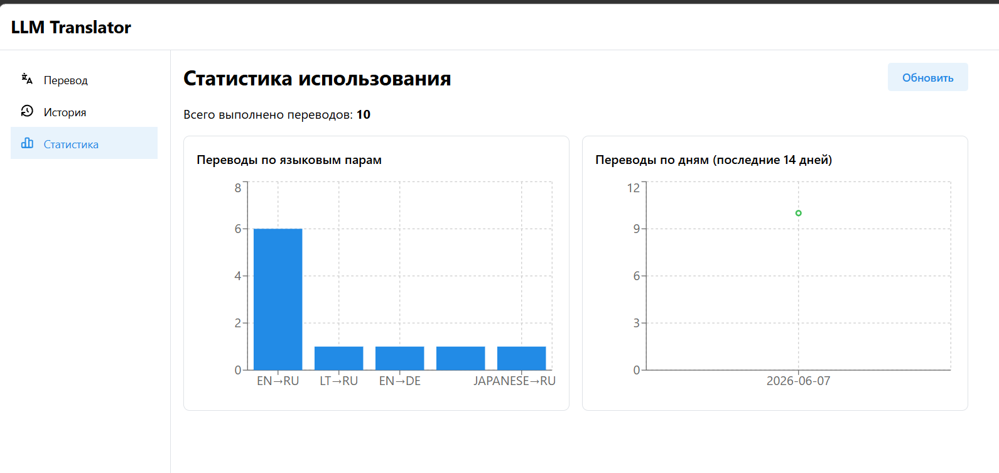
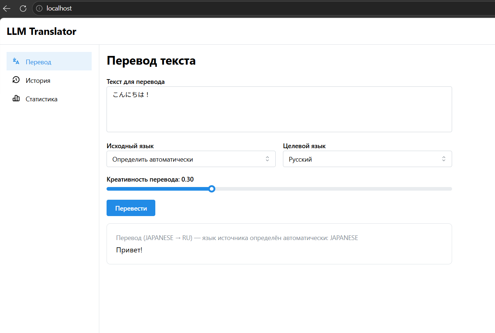
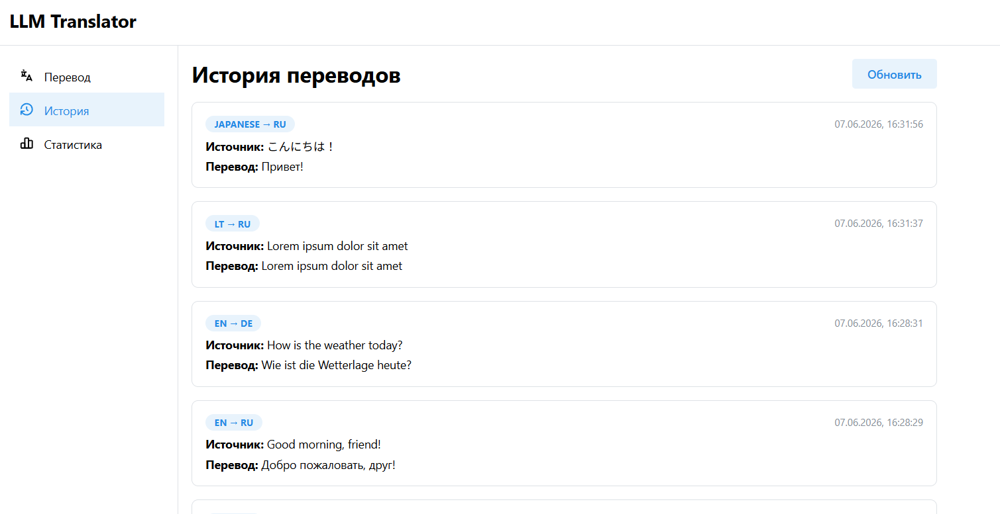

# LLM Translator

Сервис перевода текста между языками на базе LLM. Backend - FastAPI + Celery/Redis + PostgreSQL, фронтенд - React + Mantine + Vite, единая точка входа - Nginx.

## Архитектура

```
                                   ┌──────────────────────────────┐
                                   │            Nginx             │
        клиент ──── :80 ─────────▶│  /api/*  → backend            │
                                   │  /*      → frontend           │
                                   │  rate limit: 5 req/min/IP     │
                                   └───────────┬───────────────────┘
                              frontend_net     │
                       ┌───────────────────────┼─────────────────────┐
                       ▼                       ▼                     
               ┌───────────────┐      ┌─────────────────┐            
               │   Frontend    │      │   Backend (×2)  │            
               │ React+Mantine │      │     FastAPI     │            
               └───────────────┘      └────────┬────────┘            
                                                │ backend_net          
              ┌───────────────┬────────────────┼───────────────┬───────────────┐
              ▼               ▼                ▼               ▼               ▼
       ┌─────────────┐ ┌─────────────┐ ┌──────────────┐ ┌────────────┐ ┌─────────────┐
       │   Postgres  │ │    Redis    │ │ Celery worker│ │ vLLM       │ │ Prometheus/ │
       │  (история)  │ │broker/result│ │     (×2)     │ │Qwen3.5-0.8B│ │   Grafana   │
       └─────────────┘ └─────────────┘ └──────────────┘ └────────────┘ └─────────────┘
```

- **Nginx** - единственный сервис, опубликованный на хост (порт 80): маршрутизирует `/api/*` на backend, остальное - на фронтенд, ограничивает частоту запросов к API.
- **FastAPI backend** - валидация запросов, REST API, постановка задач перевода в очередь, чтение истории/статистики, health-check.
- **Celery + Redis** - асинхронная очередь: тяжёлые запросы к модели выполняются в отдельных воркерах, не блокируя API; статус задачи можно как опрашивать через REST polling (`GET /api/translate/tasks/{id}`), так и подписаться на обновления по WebSocket (`WS /api/translate/ws/{id}`).
- **vLLM (CPU)** - отдельный сервис на образе `vllm/vllm-openai-cpu`, отдаёт OpenAI-совместимый API для модели `Qwen/Qwen3.5-0.8B`. Для тестового запуска используется CPU без квантизации (образ `vllm/vllm-openai-cpu` сам по себе CPU-only) - модель достаточно компактна, чтобы это было приемлемо. При наличии GPU сервис легко переключить на квантованную модель (GPTQ/AWQ) и оптимизированный инференс на видеокарте - для этого достаточно поменять `MODEL_NAME`/образ vLLM и параметры запуска в `docker-compose.yml`, остальной стек не требует изменений.
- **PostgreSQL** - хранение истории переводов (через SQLAlchemy ORM + Alembic-миграции).
- **Frontend** - React + Mantine + Vite: страницы «Перевод», «История», «Статистика» (графики Recharts).
- **Prometheus + Grafana** - метрики и дашборд по RPS/латентности backend.

Сети: `frontend_net` (proxy ↔ frontend ↔ backend) и `backend_net` (backend ↔ worker ↔ redis ↔ postgres ↔ vllm ↔ мониторинг). Frontend и proxy не имеют доступа к Redis/Postgres.

## Запуск

1. Скопируйте файл окружения и при необходимости отредактируйте значения (токен HuggingFace, пароли):
   ```bash
   cp .env.example .env
   ```
2. Запустите весь стек:
   ```bash
   docker compose up --build -d
   ```
   `vllm` запускается на CPU (образ `vllm/vllm-openai-cpu`), GPU не требуется. При первом старте vLLM скачивает веса модели `Qwen/Qwen3.5-0.8B` - это может занять некоторое время (веса кешируются в volume `vllm_cache`).
3. Откройте в браузере `http://localhost/` - веб-интерфейс перевода.
4. Документация API (Swagger UI): `http://localhost/api/docs`.
5. Grafana: `http://localhost:3000` (логин/пароль - `GRAFANA_ADMIN_USER` / `GRAFANA_ADMIN_PASSWORD` из `.env`).

## Примеры запросов к API

Поставить текст в очередь на перевод (поддерживается 27 языков, полный список - `Language` в `backend/app/schemas.py`; `source_lang` можно указать как `auto` - модель сама определит исходный язык):
```bash
curl -X POST http://localhost/api/translate \
  -H "Content-Type: application/json" \
  -d '{"text": "Hello, how are you?", "source_lang": "auto", "target_lang": "ru", "creativity": 0.3}'
# => 202 {"task_id": "5b1e...", "status": "PENDING"}
# результат задачи будет содержать "source_lang": "en" - фактический язык, определённый моделью
```

Узнать статус задачи / получить результат (REST polling):
```bash
curl http://localhost/api/translate/tasks/5b1e...
# => {"task_id": "5b1e...", "status": "SUCCESS", "result": {"translated_text": "Привет, как дела?", ...}}
```

Тот же статус, но через WebSocket (сервер сам присылает обновления раз в секунду до завершения задачи):
```bash
websocat ws://localhost/api/translate/ws/5b1e...
```

История переводов:
```bash
curl "http://localhost/api/history?limit=10&offset=0"
```

Статистика по языковым парам и дням:
```bash
curl http://localhost/api/stats
```

Проверка состояния сервиса:
```bash
curl http://localhost/api/health
# => {"status": "ok", "components": [{"name": "postgres", "status": "ok"}, ...]}
```

## Скриншоты интерфейса

| Перевод | История | Статистика |
| --- | --- | --- |
|  |  |  |

## Структура репозитория

- `backend/` - FastAPI-приложение, Celery-задачи, ML-клиент, Alembic-миграции
- `worker/` - Dockerfile для Celery-воркера (переиспользует код backend)
- `frontend/` - React + Mantine + Vite SPA
- `proxy/` - конфигурация Nginx (единая точка входа, маршрутизация, rate limiting)
- `monitoring/` - конфигурация Prometheus и провижининг Grafana
- `docs/screenshots/` - скриншоты интерфейса для README
- `REQUIREMENTS.md` - пункт за пунктом разбор соответствия критериям оценивания
